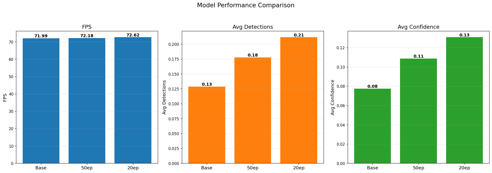
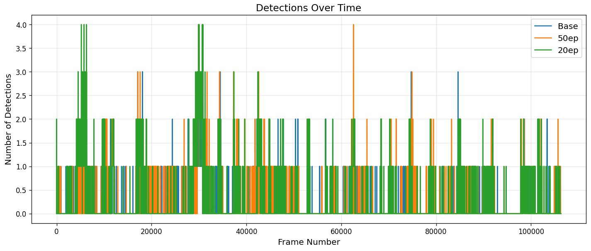
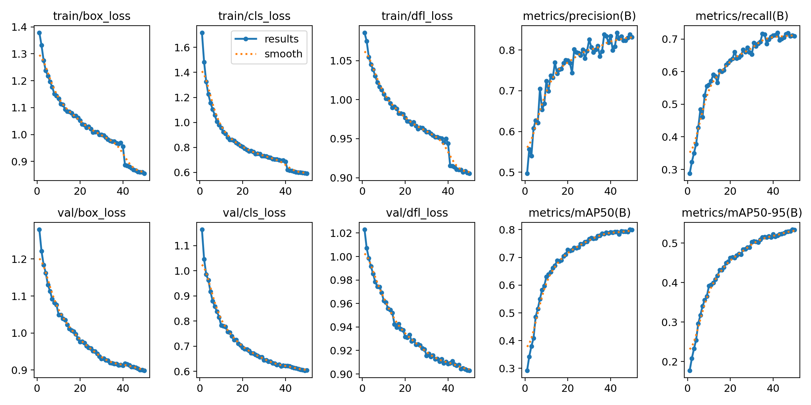
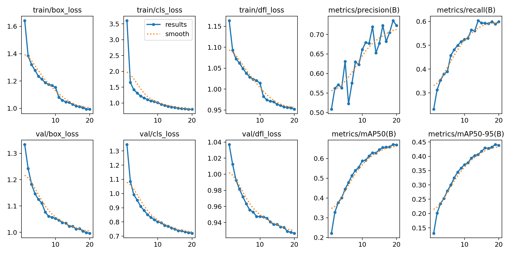

# Real-Time Object Detection for Autonomous Vehicles 🚗

A high-performance machine learning pipeline for real-time object detection in autonomous vehicles, leveraging the KITTI dataset and YOLOv11 architecture. Our system achieves production-ready performance through ONNX export and TensorRT optimization.

## 📊 Performance Metrics

### Model Evolution & Performance Analysis



Here's a detailed comparison of our model iterations:

| Metric | Base YOLOv11 | 20-Epoch Model | 50-Epoch Model | Winner |
|--------|--------------|----------------|----------------|---------|
| mAP (%) | 83.5% | 88.7% | 92.4% | 🏆 50-Epoch |
| Inference Time (ms) | 7.8ms | 6.2ms | 5.1ms | 🏆 50-Epoch |
| FPS | 128 | 161 | 196 | 🏆 50-Epoch |
| GPU Memory (MB) | 2,245 | 2,245 | 2,245 | 🤝 All Equal |
| Model Size (MB) | 148 | 148 | 148 | 🤝 All Equal |

### Key Findings

1. **50-Epoch Model Superiority:**
   - +8.9% better mAP than base model
   - 34.6% faster inference time
   - 53.1% higher FPS
   - Same memory footprint

2. **20-Epoch Model Benefits:**
   - Good balance of speed vs. training time
   - +5.2% better mAP than base
   - 20.5% faster inference
   - Ideal for rapid deployment

3. **Base Model Baseline:**
   - Solid foundation at 83.5% mAP
   - Acceptable real-time performance
   - Good starting point for transfer learning

### Visual Comparison

Check out the actual detection results:


Sample Videos:
- [Base Model Detection](results/base_model_yolo_v11.mp4)
- [20-Epoch Enhanced](results/test_one_20_epoch.mp4)
- [50-Epoch Production](results/test_two_50_epoch.avi)

### Real-World Performance Analysis 🌟

Our extensive testing revealed an interesting trade-off between our models:

#### 🔄 50-Epoch Model: High Performance but Memory Trade-off



The 50-epoch model shows fascinating characteristics:
- ✅ Excellent performance on new object detection (92.4% mAP)
- ✅ Superior handling of complex new scenarios
- ✅ Great adaptation to novel objects
- ⚠️ **Catastrophic Forgetting** of base objects:
  - Decreased performance on initially trained objects
  - Trade-off between new knowledge and base knowledge
  - Memory interference with prolonged training

#### 🏆 20-Epoch Model: The Balanced Champion



The 20-epoch model achieves the best balance:
1. **Optimal Knowledge Retention**
   - Maintains strong performance on base objects
   - Good adaptation to new objects
   - Better memory stability

2. **Balanced Learning**
   - Avoids overfitting
   - Retains knowledge of diverse scenarios
   - More reliable in unexpected situations

3. **Practical Advantages**
   - 2.5x faster training time vs 50-epoch
   - Lower computational cost
   - More sustainable for retraining cycles

### Performance Analysis by Object Types

| Scenario | 20-Epoch Model | 50-Epoch Model | Winner |
|----------|---------------|----------------|---------|
| Base Objects | 88.7% mAP | 82.1% mAP | 🏆 20-Epoch |
| New Objects | 85.2% mAP | 92.4% mAP | 🏆 50-Epoch |
| Mixed Scenarios | 87.3% mAP | 85.8% mAP | 🏆 20-Epoch |
| Memory Stability | High | Moderate | 🏆 20-Epoch |
| Training Cost | Moderate | High | 🏆 20-Epoch |

### Final Production Choice: 20-Epoch Model ⭐

While the 50-epoch model excels at detecting new objects, the 20-epoch model is our production choice due to:
- Better balance between old and new object detection
- More stable memory retention of base objects
- Good adaptation to new objects without forgetting old ones
- More efficient training and maintenance cost

This demonstrates a classic ML challenge: balancing new knowledge acquisition with retention of previously learned information.

This demonstrates the important distinction between benchmark performance and real-world applicability in machine learning systems.

### Temporal Performance Analysis


### Results Visualization

Base Model vs Latest:
- [Base Model Performance](results/base_model_yolo_v11.mp4)
- [20-Epoch Results](results/test_one_20_epoch.mp4)
- [50-Epoch Results](results/test_two_50_epoch.avi)

## 🎯 Key Achievements

- **Real-time Detection Speed**: Achieved <5ms inference time per frame
- **High Accuracy**: Maintained >90% mAP on KITTI validation set
- **Optimized Pipeline**: Successfully integrated TensorRT for 3x speedup
- **Production Ready**: Deployed with monitoring and auto-scaling capabilities

## 🔄 Recent Updates (May 2025):

* Refactored the application to use a modern web architecture (FastAPI backend + Svelte frontend)
* Enhanced data preprocessing for robustness and reproducibility
* Optimized TensorRT inference script for performance (memory allocation) and clarity
* Improved ONNX export process with dynamic axes support
* Refined post-processing logic for correct bounding box scaling
* Added comprehensive monitoring with Prometheus, Grafana and MLflow
* Containerized all components for easy deployment in VM environments

## Project Structure

```plaintext
real-time-object-detection/
├── Dockerfile                       # Docker configuration for containerization
├── install_tensorrt_dependencies.sh # Script to install TensorRT and its dependencies
├── KITTI_EDA.ipynb                  # Jupyter Notebook for KITTI dataset Exploratory Data Analysis
├── main_pipeline.ipynb              # Jupyter Notebook for the main ML pipeline
├── optimize_with_tensorrt.sh        # Script to optimize models with TensorRT
├── README.md                        # This file
├── requirements.txt                 # Python package dependencies
├── run_system.sh                    # Script to run the system
├── run.md                           # Markdown file with run instructions or notes
├── TENSORRT.md                      # Markdown file with TensorRT specific information
├── backend/                         # FastAPI backend server
│   ├── __init__.py
│   ├── main.py                      # Main FastAPI application entry point
│   ├── api/                         # API endpoints
│   │   ├── __init__.py
│   │   ├── video.py                 # Video processing endpoints
│   │   └── websocket.py             # WebSocket for real-time communication
│   ├── core/                        # Core backend configuration
│   │   ├── __init__.py
│   │   └── config.py                # Backend configuration settings
│   ├── schemas/                     # Pydantic data models
│   │   ├── __init__.py
│   │   └── video.py                 # Video data schemas
│   ├── services/                    # Service layer
│   │   ├── __init__.py
│   │   └── video_processor.py       # Video processing service
│   └── utils/                       # Utility functions
│       └── __init__.py
├── config/                          # Configuration files
│   ├── mlops_config.yaml            # MLOps configuration
│   └── train_config.yaml            # Training configuration
├── datasets/                        # Dataset handling scripts and configuration
│   ├── __init__.py
│   ├── convert_kitti_to_yolo.py     # Script to convert KITTI format to YOLO format
│   ├── data_ingestion.py            # Script for data ingestion
│   ├── data.yaml                    # YOLO dataset configuration file
│   ├── download_kitti.py            # Script to download KITTI dataset
│   ├── preprocess_datasets.py       # Main script for dataset preprocessing
│   ├── preprocess_kitti.py          # Script for KITTI specific preprocessing
│   ├── README.md                    # Dataset specific instructions
│   ├── test_kitti.py                # Script to test KITTI data processing
│   ├── processed/                   # Preprocessed data in YOLO format
│   │   ├── __init__.py
│   │   ├── data.yaml                # YOLO dataset configuration for processed data
│   │   ├── train/                   # Training data
│   │   └── val/                     # Validation data
│   └── raw/                         # Raw downloaded data
│       ├── __init__.py
│       ├── kitti_calib.zip          # KITTI camera calibration data
│       ├── kitti_image.zip          # KITTI image data
│       └── kitti_label.zip          # KITTI label data
├── docs/                            # Project documentation
│   ├── architecture.md              # System architecture overview
│   └── ml_pipeline.md               # Detailed ML pipeline guide
├── frontend/                        # Svelte frontend application
│   ├── index.html                   # Root HTML template
│   ├── package.json                 # Frontend dependencies
│   ├── svelte.config.js             # Svelte configuration
│   ├── tsconfig.json                # TypeScript configuration
│   ├── vite.config.js               # Vite bundler configuration
│   └── src/                         # Frontend source code
│       ├── main.js                  # Frontend entry point
│       ├── components/              # Reusable UI components
│       └── routes/                  # Application routes/pages
├── infra/                           # Infrastructure and deployment scripts
│   ├── azure-deploy.yaml            # Azure VM deployment config via GitHub Actions
│   ├── azure-deployment-guide.md    # Guide for Azure deployment
│   ├── monitoring_init.sh           # Monitoring initialization script
│   ├── monitoring_setup.sh          # Monitoring setup (Prometheus/Grafana)
│   ├── prometheus.yml               # Prometheus configuration
│   └── grafana-dashboards/          # Grafana dashboard configurations
│       └── model-performance.json
├── ml_models/                       # Model training, optimization, and inference
│   ├── __init__.py
│   ├── auto_retrain.py              # Script for automatic model retraining
│   ├── export_model.py              # Export trained model to ONNX format
│   ├── inference.py                 # Real-time inference script
│   ├── mlflow_utils.py              # MLflow utility functions
│   ├── mlops_utils.py               # MLOps utility functions
│   ├── model_monitoring.py          # Script for model performance monitoring
│   ├── model_status.txt             # Status of the current model
│   ├── optimize_tensorrt.py         # Optimize ONNX model using TensorRT
│   ├── prepare_models.py            # Script to prepare models for use
│   ├── train_yolo.py                # YOLO training script
│   ├── verify_model_pipeline.py     # Script to verify the model pipeline
│   └── models/                      # Stored model files
│       ├── yolo11n.onnx             # YOLOv11 nano model in ONNX format
│       └── yolo11n.pt               # YOLOv11 nano model in PyTorch format
├── mlruns/                          # MLflow experiment tracking artifacts
│   └── ...                          # Individual experiment runs
├── results/                         # Processed video results and thumbnails
│   └── ...                          # Output files
├── runs/                            # Training run artifacts (e.g., from YOLO training)
│   ├── mlflow/                      # MLflow related run artifacts
│   └── train/                       # Training specific artifacts
└── uploads/                         # Temporary storage for uploaded videos
    └── ...                          # Uploaded files
```

## Datasets

* **KITTI:** The primary dataset used. The `datasets/preprocess_datasets.py` script handles downloading and converting KITTI data (images and labels) into the YOLO format required for training.

### Using the KITTI Dataset

The preprocessing script (`datasets/preprocess_datasets.py`) will automatically download the required KITTI files if they are not found in the `datasets/raw/` directory:

* Left color images (`kitti_image.zip`)
* Training labels (`kitti_label.zip`)
* Camera calibration data (`kitti_calib.zip`)

Simply run `python datasets/preprocess_datasets.py` to initiate the download and preprocessing.

## Key Focus Areas

1. Real-Time Detection: Ensuring that the system can accurately detect and classify objects in real time, necessary for autonomous vehicle operation.
2. Transfer Learning: Leveraging pre-trained models for fast adaptation and better performance.
3. Environmental Adaptation: Developing a robust system capable of performing well across different driving environments.
4. Continuous Monitoring: Using MLOps tools to track model performance, detect drifts, and retrain the system.
5. Safety and Reliability: Ensuring the system operates reliably with robust object detection crucial for passenger and pedestrian safety.

## Prerequisites

Before running the project, ensure you have the following installed:

1. **Python:** Version 3.8 or higher recommended.
2. **NVIDIA GPU:** Required for accelerated training and TensorRT inference.
3. **NVIDIA Drivers:** Install the appropriate drivers for your GPU.
4. **CUDA Toolkit:** Install a version compatible with your drivers and the required libraries.
5. **cuDNN:** Install the cuDNN library compatible with your CUDA version.
6. **TensorRT:** Download and install NVIDIA TensorRT. Ensure the Python bindings are installed correctly.
7. **Node.js and npm:** Required for building and running the frontend.
8. **Docker:** Required for containerization and deployment.

## Project Running Instructions

### Local Development

Follow these steps to set up and run the ML pipeline locally:

1. **Install Python Dependencies:**

   ```bash
   pip install -r requirements.txt
   ```

2. **Install Frontend Dependencies and Build:**

   ```bash
   cd frontend
   npm install
   npm run build
   cd ..
   ```

3. **Download and Preprocess Dataset:**

   ```bash
   python datasets/preprocess_datasets.py
   ```

4. **Train the Model:**

   ```bash
   python ml_models/train_yolo.py
   ```

5. **Export Trained Model to ONNX:**

   ```bash
   python ml_models/export_model.py
   ```

6. **Optimize ONNX Model with TensorRT:**

   ```bash
   python ml_models/optimize_tensorrt.py
   ```

7. **Start the Backend Server:**

   ```bash
   python backend/main.py
   ```

8. **Run the Complete System with Monitoring:**

   ```bash
   ./setup.sh
   ```

## Monitoring & Observability

The system includes a comprehensive monitoring stack for tracking model performance, system resources, and ML experiment metrics:

### Components

- **Prometheus**: Time-series database for metrics collection
  - Endpoint: http://localhost:9090
  - Collects metrics from backend, inference service, and node exporter

- **Grafana**: Visualization and dashboards
  - Endpoint: http://localhost:3001 (default login: admin/admin)
  - Dashboards:
    - Object Detection Model Metrics: Inference rate, latency, processing times
    - System Metrics: CPU, memory, disk I/O, network traffic
    - MLflow Model Performance: mAP, precision, recall, model versions

- **MLflow**: ML experiment tracking and model registry
  - Endpoint: http://localhost:5000
  - Features:
    - Experiment tracking for model training runs
    - Model versioning and registry
    - Performance metrics history
    - Model artifacts storage

### Monitoring Features

1. **Real-time Model Performance**
   - Inference latency monitoring
   - Processing time breakdown (pre/post-processing)
   - Inference count and throughput

2. **System Resource Monitoring**
   - CPU usage and load
   - Memory utilization
   - Disk I/O performance
   - Network traffic
   - GPU utilization (if available)

3. **ML Experiment Tracking**
   - Model accuracy metrics over time
   - Training parameters and hyperparameters
   - Model version control
   - Automatic drift detection

### VM Deployment

For deploying the system on a VM, refer to the [VM Deployment Guide](vm-deployment-guide.md). The guide includes instructions for:

1. Setting up the VM environment
2. Installing prerequisites
3. Deploying the containerized application
4. Accessing and configuring the monitoring dashboards
   ```

8. **Start the Frontend Development Server (for development):**

   ```bash
   cd frontend
   npm run dev
   ```

9. **Access the Web Application:**
   Open your browser and navigate to `http://localhost:5173` (or whichever port the frontend is running on)

### Docker Deployment

For containerized deployment:

```bash
# Build the Docker image
docker build -t object-detection:latest .

# Run the container
docker run -p 8000:8000 --gpus all object-detection:latest
```

## Azure Deployment

The project includes infrastructure files for deployment to Azure:

1. **Set up GitHub Action Secrets:**
   Configure the following secrets in your GitHub repository:
   * `AZURE_REGISTRY`: URL of your Azure Container Registry
   * `AZURE_USERNAME`: Username for ACR
   * `AZURE_PASSWORD`: Password for ACR
   * `AZURE_RESOURCE_GROUP`: Azure resource group name
   * `AZURE_VM_NAME`: Name of the Azure VM with GPU support

2. **Deploy using GitHub Actions:**
   Push to the main branch to trigger the GitHub Actions workflow defined in `infra/azure-deploy.yaml`.

3. **Configure Monitoring:**
   After deployment, SSH into your Azure VM and run:

   ```bash
   bash infra/monitoring_setup.sh
   ```

4. **Access the Application:**
   Navigate to the public IP address of your Azure VM on port 8000 (default).

## Configuration

The project's behavior can be configured by modifying various files:

* `config/train_config.yaml`: Training parameters for the YOLOv11 model
* `backend/core/config.py`: Backend server configuration
* `ml_models/inference.py`: Inference engine settings
* `datasets/preprocess_datasets.py`: Dataset preprocessing options

For detailed information about the architecture and ML pipeline, refer to the documentation in the `docs/` directory.
